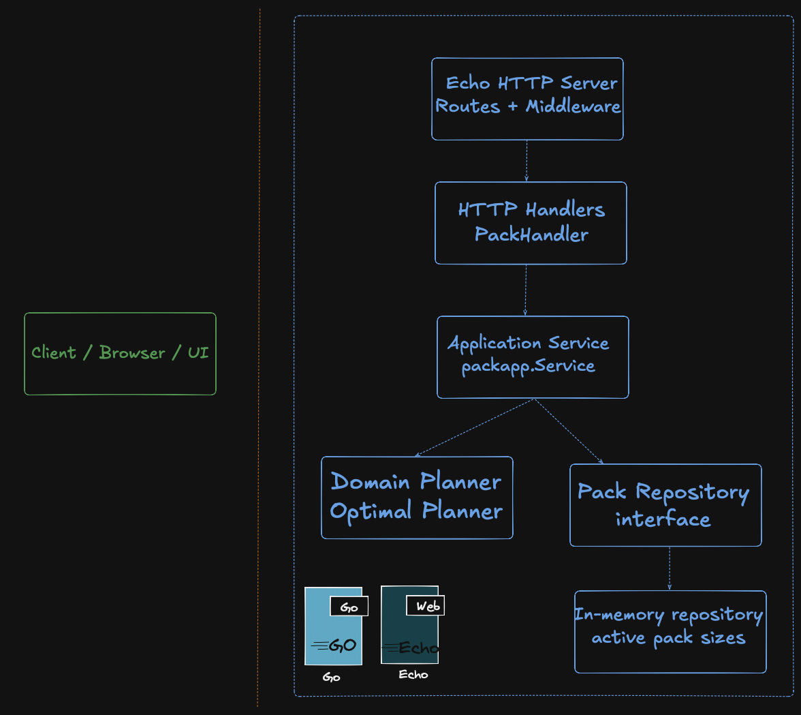

# 📦 Pack Planner

Pack Planner is a Go service that calculates the best pack combination for a customer order written with Echo web framework.

The application follows the challenge rules in this order:

1. Packs cannot be split.
2. The shipped total must be as small as possible while still fulfilling the order.
3. If multiple solutions ship the same total, the one with fewer packs wins.

Example:

- Order `501`
- Pack sizes `[250, 500, 1000, 2000, 5000]`
- Best result: `500 + 250 = 750`

`1000` would use fewer packs, but it ships more items than necessary, so it is not the correct answer.

## What This Project Includes

- A Go HTTP API built with Echo
- A standalone browser UI in the sibling `../ui/` directory
- Configurable pack sizes
- A bottom-up dynamic programming solution
- Unit tests for the core algorithm
- Swagger UI and OpenAPI documentation
- A lightweight Docker image

## Tech Stack

- Go `1.25`
- Echo `v4`
- In-memory pack size storage
- Embedded Swagger UI
- Vanilla HTML, CSS, and JavaScript frontend
- Multi-stage Docker build

## Project Structure

```text
repo-root/
├── packplanner/
│   ├── cmd/api
│   ├── internal
│   ├── Dockerfile
│   └── README.md
└── ui/
    ├── app.js
    ├── config.js
    ├── index.html
    └── styles.css
```

Layer overview:

- `cmd/api`
  Application entry point and dependency wiring.
- `internal/domain/pack`
  Core business rules and pack planning algorithm.
- `internal/application/packapp`
  Use cases that orchestrate repository and planner interactions.
- `internal/infrastructure/repository/memory`
  In-memory implementation for active pack sizes.
- `internal/transport/httpapi`
  HTTP handlers, response envelope, routing, and Swagger assets.
- `../ui`
  Standalone frontend files that can be hosted or removed independently.

## Infrastructure Overview

The following diagram shows the high-level flow of the application:



Reading the diagram from top to bottom:

- The client can be a browser, Swagger UI, curl, or a frontend application.
- Echo receives the HTTP request and routes it to the correct handler.
- The HTTP layer translates requests into application use cases.
- The application service coordinates the pack planning flow.
- The domain planner contains the core optimization logic.
- The repository provides the currently active pack sizes.
- `main.go` wires all dependencies together and starts the server.

## Quick Start

### Run locally

```bash
go run ./cmd/api
```

By default the API starts on:

- [http://localhost:8680](http://localhost:8680)
- Swagger UI: [http://localhost:8680/swagger](http://localhost:8680/swagger)

### Run tests

```bash
go test ./...
```

### Run with Docker

Build the image:

```bash
docker build -t packplanner .
```

Run the container:

```bash
docker run --rm -p 8680:8680 packplanner
```

The Docker image exposes:

- [http://localhost:8680](http://localhost:8680)
- Swagger UI: [http://localhost:8680/swagger](http://localhost:8680/swagger)

## Configuration

The service can be configured with environment variables:

| Variable | Default                  | Description |
| --- |--------------------------| --- |
| `PORT` | `8680`                   | HTTP port used by the application |
| `PACK_SIZES` | `250,500,1000,2000,5000` | Comma-separated active pack sizes |
| `ALLOWED_ORIGINS` | `http://localhost:3000,http://127.0.0.1:3000` | Comma-separated origins allowed by CORS |

Example:

```bash
PORT=9090 PACK_SIZES=250,400,800 go run ./cmd/api
```

Example with CORS:

```bash
ALLOWED_ORIGINS=http://localhost:3000,https://your-amplify-domain.amplifyapp.com go run ./cmd/api
```

## Response Format

All JSON API responses follow the same envelope:

```json
{
  "message": "pack plan calculated successfully",
  "success": true,
  "data": {}
}
```

Error responses keep the same shape:

```json
{
  "message": "order quantity must be greater than zero",
  "success": false
}
```

## API Endpoints

| Method | Path | Description |
| --- | --- | --- |
| `GET` | `/` | Health check |
| `GET` | `/health` | Health check |
| `GET` | `/api/v1/pack-sizes` | Returns the active pack sizes |
| `PUT` | `/api/v1/pack-sizes` | Replaces the active pack sizes |
| `POST` | `/api/v1/pack-plans` | Calculates the optimal shipment plan |
| `GET` | `/swagger` | Swagger UI |
| `GET` | `/swagger/openapi.json` | OpenAPI specification |

## Example Requests

### Health check

```bash
curl http://localhost:8680/
```

Response:

```json
{
  "message": "service is healthy",
  "success": true,
  "data": {
    "status": "ok"
  }
}
```

### Read active pack sizes

```bash
curl http://localhost:8680/api/v1/pack-sizes
```

Response:

```json
{
  "message": "pack sizes retrieved successfully",
  "success": true,
  "data": {
    "pack_sizes": [250, 500, 1000, 2000, 5000]
  }
}
```

### Update pack sizes

```bash
curl -X PUT http://localhost:8680/api/v1/pack-sizes \
  -H "Content-Type: application/json" \
  -d '{
    "pack_sizes": [250, 500, 1000, 2000, 5000]
  }'
```

### Calculate a pack plan

```bash
curl -X POST http://localhost:8680/api/v1/pack-plans \
  -H "Content-Type: application/json" \
  -d '{
    "order_quantity": 12001
  }'
```

Response:

```json
{
  "message": "pack plan calculated successfully",
  "success": true,
  "data": {
    "order_quantity": 12001,
    "total_items": 12250,
    "total_packs": 4,
    "packs": [
      {
        "pack_size": 5000,
        "quantity": 2
      },
      {
        "pack_size": 2000,
        "quantity": 1
      },
      {
        "pack_size": 250,
        "quantity": 1
      }
    ]
  }
}
```

## How the Algorithm Works

This project uses a bottom-up dynamic programming approach.

The planner:

1. Normalizes pack sizes by validating, de-duplicating, and sorting them.
2. Builds reachable totals from the smallest pack size up to a safe upper bound.
3. Stores the best way to reach each exact total.
4. Chooses the smallest reachable total that satisfies the order.
5. Rebuilds the final pack breakdown from the recorded DP path.

Why this approach:

- It guarantees correctness for configurable pack sizes.
- It avoids greedy mistakes.
- It cleanly supports the challenge rule priority:
  minimal shipped items first, minimal pack count second.

## UI Notes

The repository uses a single-repo setup:

- The Go backend lives in the main module.
- The browser UI lives in the sibling `../ui/` directory.
- The backend does not import or serve any frontend files.
- The UI can be hosted separately or removed without affecting the Go service.

To connect the UI to your backend, edit:

- [config.js](/Users/melih/work/case/repartners/ui/config.js)

Example:

```js
window.PACKPLANNER_CONFIG = {
  apiBaseUrl: "https://your-api-domain.com",
};
```

You can run the UI with any static file server. For example:

```bash
python3 -m http.server 5500 --directory ../ui
```

Then open:

- [http://localhost:5500](http://localhost:5500)

By default the standalone UI targets:

- [http://localhost:8680](http://localhost:8680)

For Amplify, you only need to publish the sibling `ui/` directory as a static site and set the backend URL in `config.js`.

## Notes on Storage

Pack sizes are currently stored in memory.

This keeps the project simple and focused on the core problem. It also makes it easy to swap the storage implementation later without changing the domain logic.

## Notes on Docker

The Docker image uses a multi-stage build:

- `golang:1.25-alpine` for building
- `scratch` for the final runtime image

This keeps the final image very small while still exposing the service on port `8680`.

## Suggested Next Improvements

- Add a persistent repository implementation such as SQLite
- Add request size and input limits for extra hardening
- Add integration tests for HTTP handlers
- Add CI for test and lint checks
